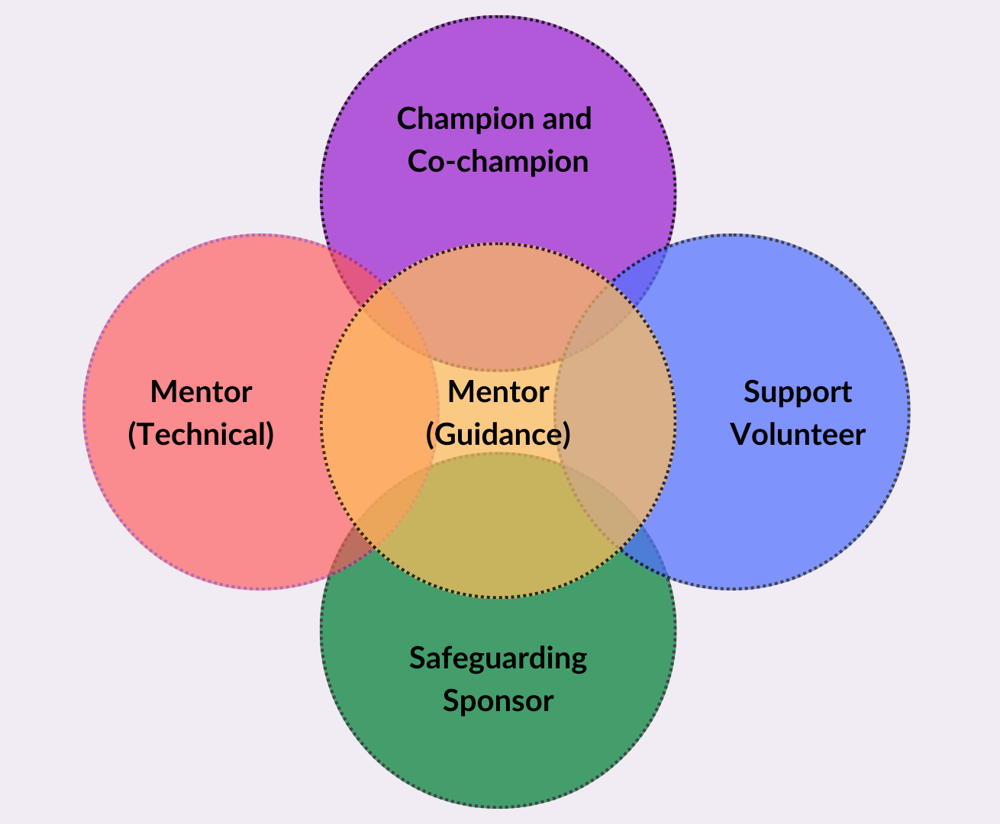

## How to develop role descriptions

People are much more likely to respond positively to a request to do specific tasks rather than fill a role where they are unsure of what is required of them. Volunteer role descriptions outline what a role involves. They ensure both the volunteer and others in the Dojo have a clear understanding of the tasks they will be expected to do.

**Role descriptions usually include:**
+ role title 
+ aims and expectations of role
+ an outline of the role's tasks
+ location, timing and regularity of sessions ie. how long and where you need volunteers to be present

Descriptions can also include why a new volunteer might like to take up the opportunity, how the role fits within the Dojo, expectations of behaviour
as well as desirable skills and qualifications.

## Example role descriptions
Below are six different example volunteer role descriptions that you can adapt to suit the needs of your Dojo.
  
The role descriptions are not exclusive or exhaustive. Many volunteers will have a primary role, but will help out in other areas of the club and with other tasks as required.
  

--- collapse ---

---
title: Dojo Champion/Co-champion
---

**Aims and expectations:** Manages the overall running of the Dojo, including recruiting and onboarding volunteers, liaising with the venue, supporting and managing volunteers, communicating with parents.
  
**Example tasks:**
+ Manages the booking and communications with the venue
+ Coordinates Dojo volunteers, ensuring they are briefed for each session
+ Plans activities for sessions, with support from mentors
+ Manages the recruitment and onboarding process of new volunteers
+ Sets up the venue space and tidies equipment away at the end of session

**Location and times:** The Dojo hosts sessions <mark>every week/fortnight/month</mark>  on <mark>day/dates</mark> from <mark>start time</mark> to <mark>end time</mark>. Champions usually arrive 30 minutes in advance of the session, and stay 30 minutes after the session ends to make sure volunteers are debriefed and the venue is tidied. This Dojo usually runs during regular school term time, taking a break for holidays and midterm. 
This is an unpaid volunteer role.

--- /collapse ---
  

--- collapse ---

---
title: Mentor (technical)
---

**Aims and expectations:** Uses their own coding experience or technical knowledge to support and guide young people in a session. They may also prepare learning resources or activities for sessions.

**Example tasks:**
+ Help to plan and prepare resources ahead of sessions
+ Provide support to young people who are new to coding
+ Provide technical guidance to help young people progress with their projects
+ Help to set up technical equipment before sessions and tidy away equipment at the end of sessions

**Location and times:** The Dojo hosts sessions <mark>every week/fortnight/month</mark>  on <mark>day/dates</mark> from <mark>start time</mark> to <mark>end time</mark>. Mentors usually arrive 10 minutes in advance of the session, and stay 10 minutes after the session ends. This Dojo usually runs during regular school term time, taking a break for holidays and midterm. 
This is an unpaid volunteer role.

--- /collapse ---
  
--- collapse ---

---
title: Mentor (guidance)
---

**Aims and expectations:** A mentor who supports and encourages young people  participating in activities during the session. They may also prepare learning resources or activities for sessions. No coding experience is required.

**Example tasks:**
+ Help to plan sessions
+ Welcome attendees as they arrive at the sessions
+ Help to set up the venue space and tidy away at the end of sessions
+ Encourage young people to participate in the session activities
+ Provide support to young people 

The Dojo hosts sessions <mark>every week/fortnight/month</mark>  on <mark>day/dates</mark> from <mark>start time</mark> to <mark>end time</mark>. Mentors usually arrive 10 minutes in advance of the session, and stay 10 minutes after the session ends. Dojo usually runs during regular school term time, taking a break for holidays and midterm. 
This is an unpaid volunteer role.

--- /collapse ---
  
--- collapse ---

---
title: Support volunteer
---

**Aims and expectations:** A volunteer who helps with tasks to coordinate and organise the Dojo and its communications. They may not be required to attend the sessions and may focus mainly on administrative and coordination tasks.

**Example tasks:**
+ Promote Dojo sessions locally
+ Communicate updates with parents and guardians of young people
+ Help to organise the session space and equipment

The Dojo hosts sessions <mark>every week/fortnight/month</mark>  on <mark>day/dates</mark> from <mark>start time</mark> to <mark>end time</mark>. This Dojo usually runs <mark>during regular school term time, taking a break for holidays and midterm</mark>. 
This is an unpaid volunteer role.

--- /collapse ---
  
--- collapse ---

---
title: Safeguarding sponsor
---

**Aims and expectations:** The safeguarding sponsor should be a team member of the venue/organisation that agrees to take responsibility for safeguarding issues, including appropriate background checks for the Dojo champion and volunteers. If there is no-one from the venue who can fulfil this position, another appropriate sponsor would be a person holding a manager-level position within a school, library, or corporate/non-profit organisation.

Example tasks:

+ Ensure that the Dojo operates in accordance with the [safeguarding policy](https://www.raspberrypi.org/safeguarding/){:target="_blank"}.
+ Ensure that all volunteers have the [appropriate background checks](https://help.coderdojo.com/cdkb/s/article/Background-Checking-Volunteers){:target="_blank"}.

The Dojo hosts sessions <mark>every week/fortnight/month</mark>  on <mark>day/dates</mark> from <mark>start time</mark> to <mark>end time</mark>. This Dojo usually runs <mark>during regular school term time, taking a break for holidays and midterm</mark>. 
This is an unpaid volunteer role.

--- /collapse ---

  
--- task ---

**Write a role description** for the roles available at your Dojo using the examples above and considering the specific needs of your Dojo. 

--- /task ---
  
Focus on speaking to people connected to the Dojo, and passionate about young people learning to create with technology first. If needed you can then reach out to the wider community.

When writing the description, make sure it offers a good volunteering experience, so it is attractive to potential volunteers. Some things that can make the experience positive for volunteers are listed below.

+ Enjoyable
+ Inclusive of everyone
+ Voluntary, not an obligation
+ Flexible around people's lives
+ Makes a difference and impactful
+ Doesn't overburden the volunteer
+ Opportunity to connect with others, and the cause
+ Meaningful to volunteers' lives, interests and priorities

The **benefits of volunteering** include learning new skills (communication, teamwork, group management), the opportunity to share your knowledge and experience, making new friends and feeling empowered by helping young people develop skills for the future.

  
Are there other benefits you and others in your Dojo have gained through the experience of volunteering? 
  
--- task ---
  
**Write** down three benefits of volunteering with your Dojo, so you have them to mind when talking to potential volunteers.

--- /task ---

--- collapse ---

---
title: Clarity with volunteer role descriptions
---

Make sure that your volunteer role description does not read like a job description. You can describe the activities you want them to carry out as "expectations" instead of "jobs" or "requirements". Be clear that it is an unpaid voluntary role, and volunteers can leave at any time.

--- /collapse ---
  
--- task ---
Ensure the volunteer role description is attractive to potential volunteers, and does not read like a job description.
--- /task ---

